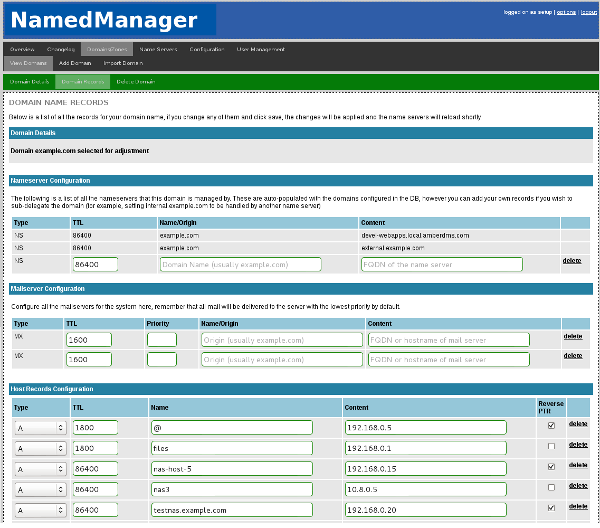
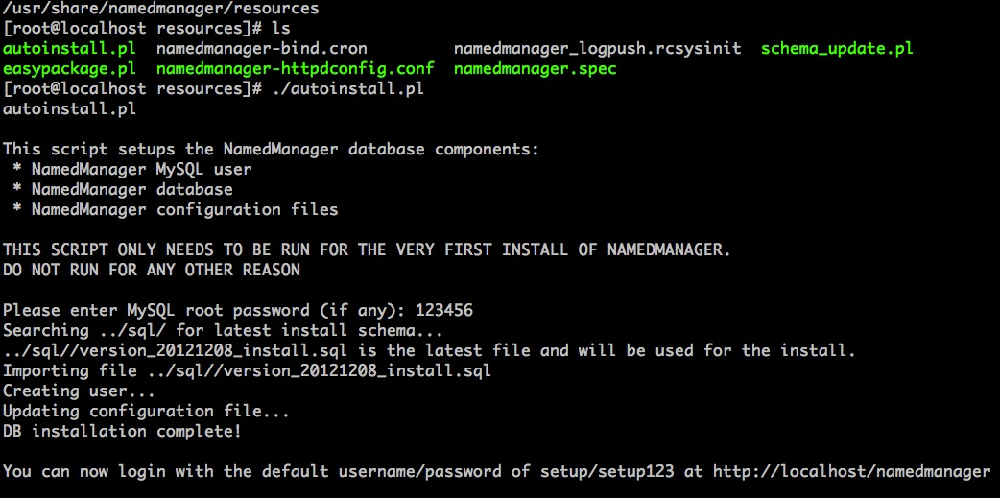
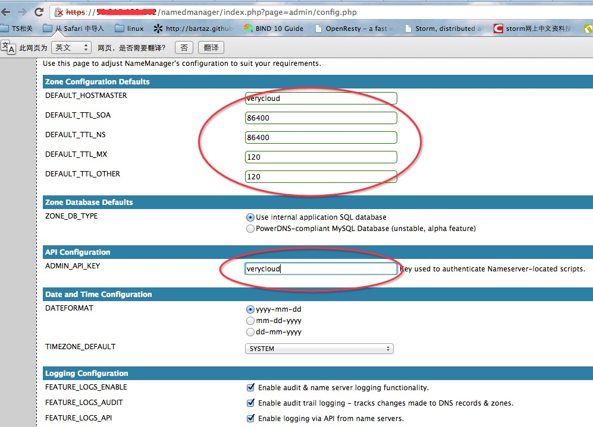

namedmanager
##########

###1.简介
NamedManager 是一个基于 Web 的 DNS 管理系统，可用来添加、调整和删除 DNS 的 zones/records 数据，支持 Bind 作为后端的 DNS 服务，支持 IPv4 和 IPv6。

###2.用途
最简单直接的用途是在管理DNS记录上。添加删除更方便

####3.安装和使用

**本文是针对centos 6 系统为范本**

下载包并安装。rpm包在rpm目录

安装如下：

	rpm -Uvh namedmanager-bind-1.5.1-1.el6.noarch.rpm
	[root@localhost noarch]# rpm -ihv namedmanager-www-1.5.1-1.el6.noarch.rpm 
	Preparing...                ########################################### [100%]
	   1:namedmanager-www       ########################################### [100%]
	   Reloading httpd...
	   Reloading httpd: 
	   Run cd /usr/share/namedmanager/resources/; ./autoinstall.pl to install the SQL database.

	cd /usr/share/namedmanager/resources/

	./autoinstall.pl

输入mysql密码完成Sql 导入和配置文件生成。截图如下：

####数据库部分参考:（已经安装并熟知的可以跳过）
    
安装数据库

	yum -y install mysql-server

启动Mysql

	service mysqld start

设置mysql密码

	mysqladmin -u root password '123456

namedmanager配置文件如下：

	/etc/namedmanager/config.php

	<?php
	$config["db_host"] = "localhost";                       // hostname of the MySQL server
	$config["db_name"] = "namedmanager";                            // database name
	$config["db_user"] = "namedmanager";                            // MySQL user
	$config["db_pass"] = "iv262niram6";                             // MySQL password (if any)
	$config["AUTH_METHOD"] = "sql";
	?>

导入完成后可web管理:

	https://xx.xx.xx.xx/namedmanager/index.php

	默认用户名和密码分别为: setup  和setup123

接着设置API key 备用：

####参考文档

官方安装手册

<https://projects.jethrocarr.com/p/oss-namedmanager/page/Installation-RPM/>
